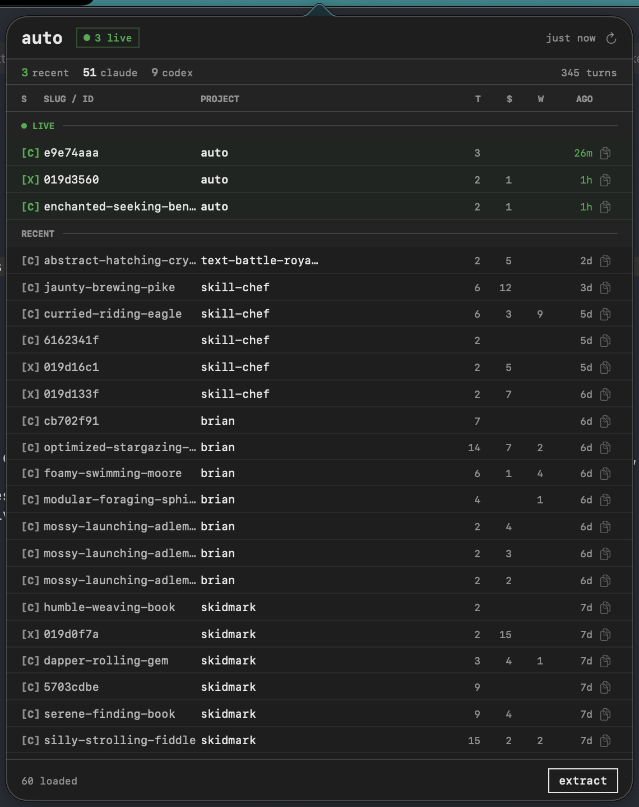

# Typewriter / macOS



SwiftUI port of the [typewriter](../typewriter.css) web design system. Same aesthetic — monospace, 1px borders, no rounding, ink/paper contrast — adapted for native macOS with SF Mono and automatic Dark Mode.

## Quick start

```bash
# Drop TypewriterStyle.swift into your project — no package needed.
# Then use the tokens directly:

Text("hello").font(.tw(13))
Button("extract") { }.twButton()
VStack { ... }.twCard()
Text("[C]").twTag(color: .twLive)
```

Run the component gallery:

```bash
swiftc -parse-as-library -target arm64-apple-macos13.0 \
       TypewriterStyle.swift TypewriterDemo.swift -o TypewriterDemo
./TypewriterDemo
```

---

## Files

| File | Purpose |
|------|---------|
| `TypewriterStyle.swift` | All tokens, modifiers, and reusable components — copy this |
| `TypewriterDemo.swift` | Standalone gallery showing every component |
| `screenshot.png` | AutoMonitor — reference implementation of this style |

---

## For LLMs — complete token and component reference

### Color tokens

All use semantic `NSColor` values → automatic Light/Dark Mode inversion.

```swift
Color.twInk     // primary text     → NSColor.labelColor
Color.twPaper   // background       → NSColor.windowBackgroundColor
Color.twMuted   // secondary text   → NSColor.secondaryLabelColor
Color.twDim     // tertiary text    → NSColor.tertiaryLabelColor
Color.twRule    // separators       → NSColor.separatorColor
Color.twZebra   // subtle row tint  → Color.primary.opacity(0.025)
Color.twActive  // selected state   → Color.primary.opacity(0.06)
Color.twLive    // green accent     → rgb(0.18, 0.68, 0.28)
Color.twWarn    // amber warning    → rgb(0.75, 0.50, 0.05)
Color.twError   // red/destructive  → rgb(0.65, 0.05, 0.05)
```

### Typography

SF Mono throughout. Use `Font.tw(_:weight:)` everywhere.

```swift
Font.tw(13)                          // arbitrary size, regular
Font.tw(11, weight: .semibold)       // arbitrary size + weight

// Semantic aliases
Font.twTitle    // tw(20, .bold)     — app name / banner
Font.twHeading  // tw(13, .semibold) — section heading
Font.twBody     // tw(12)            — normal copy
Font.twSmall    // tw(10)            — metadata / labels
Font.twTiny     // tw(9, .bold)      — column headers, badges
Font.twCode     // tw(11)            — code / terminal output
```

### Spacing

```swift
TWSpacing.xs   //  4pt
TWSpacing.sm   //  6pt
TWSpacing.md   //  8pt
TWSpacing.lg   // 12pt
TWSpacing.xl   // 16pt
TWSpacing.xxl  // 24pt
```

### ViewModifiers

**`.twCard(padding:)`** — 1px bordered container, paper background.
```swift
VStack { ... }.twCard()
VStack { ... }.twCard(padding: TWSpacing.lg)
```

**`.twButton()`** — Ink-bordered button, plain hover/press states.
```swift
Button("submit") { }.twButton()
Button("delete") { }.twButton()   // add .foregroundColor(.twError) for danger
```

**`.twRow(highlighted:)`** — Adds 1px bottom separator; optional tinted background.
```swift
HStack { ... }.twRow()
HStack { ... }.twRow(highlighted: true)   // active/selected row
```

**`.twTag(color:)`** — Tight monospaced badge with 1px border.
```swift
Text("[C]").twTag()
Text("● live").twTag(color: .twLive)
Text("error").twTag(color: .twError)
```

### Components

**`TWSectionHeader(_ title:)`** — Uppercase label + full-width rule beneath.
```swift
TWSectionHeader("Live Sessions")
```

**`TWDivider()`** — 1px horizontal rule (`Color.twRule`).

**`TWTextField(_ placeholder:, text:)`** — Monospace input, 1px ink border.
```swift
TWTextField("search...", text: $query)
```

**`TWCodeBlock(_ text:)`** — Scrollable code output area, zebra background.
```swift
TWCodeBlock("$ go run ./extractor/main.go\n[auto] done")
```

---

## Web → Swift token map

| Concept | Web (CSS) | macOS (Swift) |
|---------|-----------|---------------|
| Font family | `Courier Prime` / `IBM Plex Mono` | `.system(design: .monospaced)` = SF Mono |
| Ink | `#111` | `NSColor.labelColor` |
| Paper | `#fff` | `NSColor.windowBackgroundColor` |
| Muted | `#555` | `NSColor.secondaryLabelColor` |
| Rule | `#d0d0d0` | `NSColor.separatorColor` |
| Border | `1px solid var(--tw-ink)` | `Rectangle().stroke(.twInk, lineWidth: 1)` |
| Radius | `border-radius: 0` | implicit (SwiftUI default is 0) |
| Hover bg | `#f5f5f5` | `Color.primary.opacity(0.06)` |
| Active bg | `#f7f7f7` | `Color.primary.opacity(0.025)` |

## Design rules

1. **Monospace everywhere** — `Font.tw()` for all text, no exceptions.
2. **1px borders, no rounding** — Use `Rectangle().stroke()`, never `.cornerRadius()`.
3. **Ink/paper duality** — High contrast primary; muted for metadata; dim for decorative chrome.
4. **Semantic colors** — Always `NSColor.*` via `Color(nsColor:)` so Dark Mode works for free.
5. **Sparse decoration** — Ruled separators over filled backgrounds. `twZebra` (2.5% opacity) is the maximum background tint for non-selected rows.
6. **No icons for content** — SF Symbols only for controls (copy, refresh, close). Never for data.
